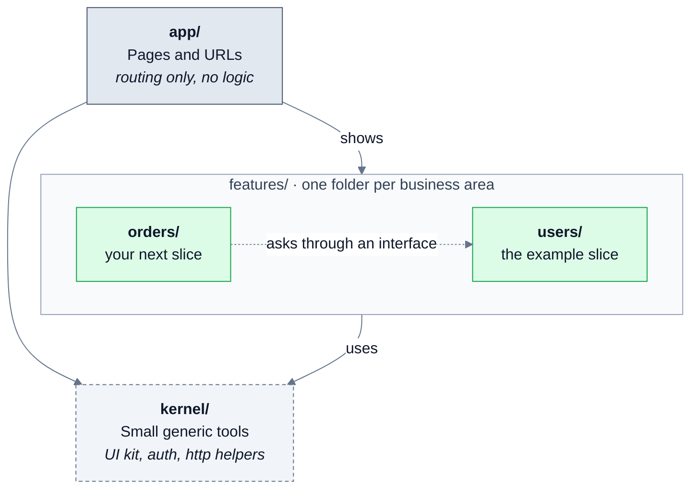
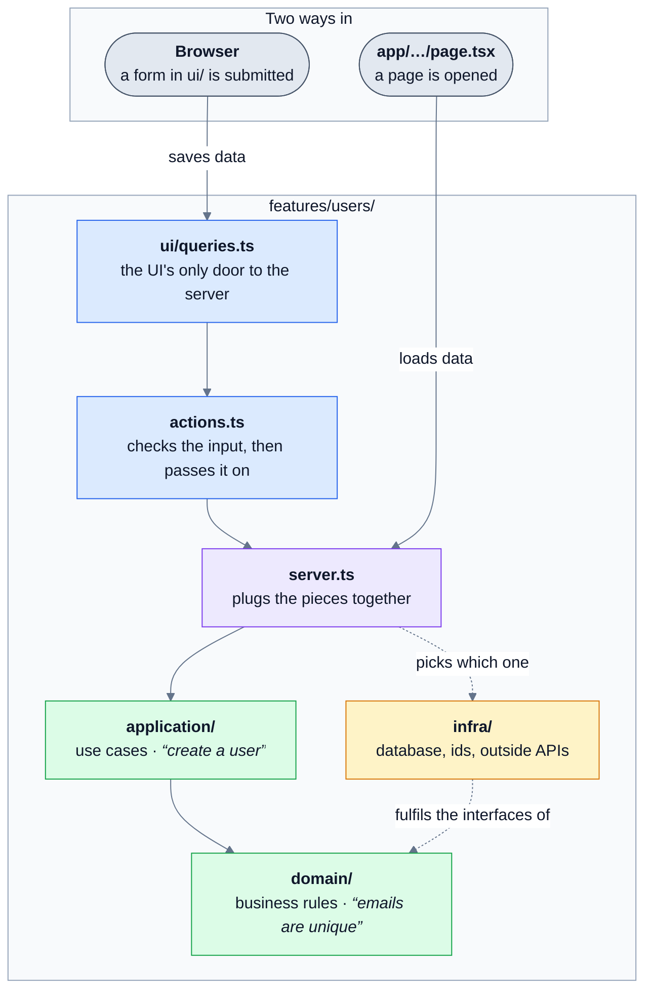

<a id="readme-top"></a>

<!-- PROJECT SHIELDS -->
[![Contributors][contributors-shield]][contributors-url]
[![Forks][forks-shield]][forks-url]
[![Stargazers][stars-shield]][stars-url]
[![Issues][issues-shield]][issues-url]
[![MIT License][license-shield]][license-url]

<!-- PROJECT LOGO -->
<br />
<div align="center">
  <a href="https://github.com/predzoned/next-vca-template">
    <!-- TODO: add a logo at public/logo.png, then uncomment -->
    <!--  -->
  </a>

  <h3 align="center">next-vca-template</h3>

  <p align="center">
    A Next.js starter organized as vertical slices, with clean architecture inside each slice.
    <br />
    <a href="./AGENTS.md"><strong>Read the conventions »</strong></a>
    <br />
    <br />
    <a href="https://github.com/predzoned/next-vca-template/issues/new?labels=bug">Report Bug</a>
    &middot;
    <a href="https://github.com/predzoned/next-vca-template/issues/new?labels=enhancement">Request Feature</a>
  </p>
</div>

<!-- TABLE OF CONTENTS -->
<details>
  <summary>Table of Contents</summary>
  <ol>
    <li>
      <a href="#about-the-project">About The Project</a>
      <ul>
        <li><a href="#architecture">Architecture</a></li>
        <li><a href="#built-with">Built With</a></li>
      </ul>
    </li>
    <li>
      <a href="#getting-started">Getting Started</a>
      <ul>
        <li><a href="#prerequisites">Prerequisites</a></li>
        <li><a href="#installation">Installation</a></li>
      </ul>
    </li>
    <li>
      <a href="#usage">Usage</a>
      <ul>
        <li><a href="#scripts">Scripts</a></li>
        <li><a href="#layout">Layout</a></li>
        <li><a href="#how-a-request-flows">How a request flows</a></li>
        <li><a href="#add-a-slice">Add a slice</a></li>
        <li><a href="#reach-another-slice">Reach another slice</a></li>
        <li><a href="#move-the-api-out-of-nextjs">Move the API out of Next.js</a></li>
        <li><a href="#swap-the-storage">Swap the storage</a></li>
        <li><a href="#import-rules">Import rules</a></li>
        <li><a href="#agent-setup">Agent setup</a></li>
      </ul>
    </li>
    <li><a href="#contributing">Contributing</a></li>
    <li><a href="#license">License</a></li>
    <li><a href="#contact">Contact</a></li>
  </ol>
</details>

<!-- ABOUT THE PROJECT -->
## About The Project

<!-- TODO: add a screenshot at public/screenshot.png and link it here -->

`next-vca-template` is a GitHub repository template for starting a [Next.js](https://nextjs.org) app with a clear, scalable folder structure. It carries no business logic, only one small example feature (`users`) that shows how the pieces fit together.

The code is organized as **vertical slices**: one slice = one bounded context (one area of the business, such as `users` or `orders`). Each slice owns its contracts, domain rules, use cases, infrastructure and UI. Nothing outside a slice knows how it works inside.

Inside each slice, **clean architecture** keeps the business rules in plain TypeScript, separate from the database and the UI. That makes the rules easy to test without a database, and lets you swap storage or move the API out of Next.js later without rewriting them.

The folder rules are enforced by Biome, so the structure stays intact as the project grows.

<p align="right">(<a href="#readme-top">back to top</a>)</p>

### Architecture

**The big picture.** `src/` has three parts. `app/` holds the pages, `features/` holds one folder per business area, and `kernel/` holds small generic tools anyone can use. Arrows mean "uses".



**Inside one slice.** Every slice has the same layers. A request comes in from the top, and the business rules sit at the bottom, where nothing else can reach in and change them.



How to read the colors:

* 🟦 **Blue: the way in.** It checks what comes in and passes it on. Swap it out to move the API out of Next.js.
* 🟪 **Purple: the wiring.** `server.ts` is the one place that decides which parts are used together, such as the in-memory store or a real database.
* 🟩 **Green: the business rules.** Plain TypeScript with no database, no React and no Next.js, so it is quick to test.
* 🟨 **Yellow: the technology.** It talks to databases and outside services, and can be swapped without touching the green parts.

`contracts/` (not drawn) holds the data shapes, checked with Zod, that every arrow above passes around.

<p align="right">(<a href="#readme-top">back to top</a>)</p>

### Built With

* [![Next][Next.js]][Next-url]
* [![React][React.js]][React-url]
* [![TypeScript][TypeScript]][TypeScript-url]
* [![Tailwind CSS][TailwindCSS]][TailwindCSS-url]
* [![shadcn/ui][shadcn]][shadcn-url]
* [![Zod][Zod]][Zod-url]
* [![Biome][Biome]][Biome-url]
* [![Vitest][Vitest]][Vitest-url]

<p align="right">(<a href="#readme-top">back to top</a>)</p>

<!-- GETTING STARTED -->
## Getting Started

Follow these steps to create your own project from this template and run it on your computer. Once it runs, write `docs/mvp-business-spec.md` and run `pnpm template:detach` so the docs and the app describe your product instead of the template.

### Prerequisites

* **Node.js 20.9 or newer** (required by Next.js 16). Download it from [nodejs.org](https://nodejs.org).
* **pnpm**. The exact version is pinned in `package.json`; Corepack installs it for you. Corepack ships with Node 20 to 24; on newer Node versions install it first with `npm install -g corepack`.
  ```sh
  corepack enable
  ```
* **Claude Code plugin marketplaces** (optional, only if you use [Claude Code](https://claude.com/claude-code)). `.claude/settings.json` turns on plugins from two marketplaces, but it does not add the marketplaces for you. Add them yourself, or those plugins won't be available. Run these inside Claude Code:
  ```sh
  /plugin marketplace add anthropics/claude-plugins-official
  /plugin marketplace add addyosmani/agent-skills
  ```

### Installation

1. Create a new repo from this template. On GitHub, click **Use this template**, or use the GitHub CLI:
   ```sh
   gh repo create my-app --template predzoned/next-vca-template --clone
   cd my-app
   ```
2. Install dependencies
   ```sh
   pnpm install
   ```
3. Create your local `.env` file from `.env.example`
   ```sh
   pnpm env:init
   ```
4. Start the development server, then open [http://localhost:3000](http://localhost:3000)
   ```sh
   pnpm dev
   ```

<p align="right">(<a href="#readme-top">back to top</a>)</p>

<!-- USAGE -->
## Usage

Read [`AGENTS.md`](./AGENTS.md) for the full conventions; this section is the quick tour.

### Scripts

```sh
pnpm dev        # start the dev server at http://localhost:3000
pnpm check      # Biome: lint + format, apply safe fixes
pnpm lint       # Biome: check only
pnpm format     # Biome: format only
pnpm test       # Vitest, runs every __tests__/ folder
pnpm test:watch # Vitest in watch mode
pnpm typecheck  # next typegen + tsc
pnpm build      # production build
pnpm start      # serve the production build
pnpm env:init   # create .env from .env.example
pnpm env:sync   # rewrite .env.example from .env (values replaced by placeholders)
pnpm env:check  # fail if .env.example is out of sync
pnpm template:detach # one-time: rewrite README, AGENTS.md, LICENSE, package.json and the app's name/tagline for your product (needs docs/mvp-business-spec.md)
```

### Layout

```
src/
├── app/                      # Next routing only, zero logic
│   ├── site.ts               # product name and tagline; pnpm template:detach rewrites it
│   └── (app)/users/page.tsx  # Server Component; calls the slice's server.ts directly
├── features/users/           # the example slice
│   ├── contracts/            # zod schemas + DTO types; the slice's public shape
│   ├── domain/               # User entity, invariants, IUserRepository, IIdGenerator
│   ├── application/          # UsersService (use cases); depends on interfaces only
│   ├── infra/
│   │   ├── in-memory/        # test doubles; also the placeholder store until a db arrives
│   │   └── crypto/           # CryptoIdGenerator (randomUUID)
│   ├── ui/                   # UserList, CreateUserForm, queries.ts (the only way ui/ reaches the server)
│   ├── actions.ts            # "use server"; parses input, calls server.ts
│   ├── server.ts             # composition root; how app/ reads and writes data
│   ├── index.ts              # server-safe exports for other slices
│   └── ui.ts                 # React exports for other slices and app/
└── kernel/                   # small, generic, knows no slice
    ├── server/http/          # helpers for route handlers (isAuthorizedBySecret)
    └── ui/                   # shadcn/ui components (pnpm shadcn add <name>)
```

Every folder has its own `__tests__/` next to the code it tests. `application/` tests run against `infra/in-memory/`, so no database is needed.

### How a request flows

- **Page** `app/(app)/users/page.tsx` -> `listUsers()` in `features/users/server.ts` -> `UsersService` -> `IUserRepository`.
- **Browser** `CreateUserForm` -> `ui/queries.ts` -> `createUserAction()` in `actions.ts` (a Server Action) -> `createUser()` in `server.ts`.
- `server.ts` returns `contracts/` types only, never domain objects or db rows. Domain errors are translated there into result types (see `CreateUserResult`).

### Add a slice

1. Copy the folder shape of `features/users` (`contracts`, `domain`, `application`, `infra/in-memory`, `ui`, `actions.ts`, `server.ts`, `index.ts`, `ui.ts`). Nothing to configure: the Biome rules and the convention tests apply to every folder under `features/` automatically.
2. Add pages under `app/(app)/<slice>/`; they import only `@/features/<slice>/server`, `contracts` and `ui`. Writes from the browser go through `actions.ts`, reached via `ui/queries.ts`.

### Reach another slice

Define what you need as an interface in your own `domain/` (e.g. `orders/domain/IUserLookup.ts`), implement it with an adapter in `orders/infra/` that imports `@/features/users` (its `index.ts`), and wire the adapter in `orders/server.ts`. `orders/domain` and `orders/application` never mention `users`.

### Move the API out of Next.js

Server Actions are used for now, but nothing depends on them except `actions.ts` and `ui/queries.ts`. To serve the API elsewhere, expose each `server.ts` function over HTTP (route handlers or a separate service), rewrite `ui/queries.ts` to call it with `fetch` using the same function signatures, and delete `actions.ts`. Components stay the same. `AGENTS.md` lists the rules that keep this cheap.

### Swap the storage

Add `features/<slice>/infra/<tech>/` (for example a Drizzle repository) and change one line in `server.ts`. The in-memory repository stays for tests.

### Import rules

Enforced by Biome (`noRestrictedImports` in `biome.json`):

| From | May import |
|---|---|
| `kernel/**` | `kernel/**` only |
| `features/X/**` | own slice (relative paths), `kernel/**`; other slices only via `features/Y` (index) or `features/Y/ui` |
| `features/X/contracts` | `zod` and sibling contracts only |
| `features/X/{domain,application}` | own `domain`, `contracts`, `zod`; no kernel, no React, no Next, no Node built-ins |
| `features/X/{infra,server.ts}` | no `kernel/ui`, no `ui/`, no `actions.ts`, no `routes.ts`; no `next/cache`, `next/headers`, `next/navigation` |
| `features/X/actions.ts` | `contracts/` and `server.ts` only; no `domain/`, `application/`, `infra/`, `ui/`, `kernel/ui` |
| `features/X/routes.ts` | like `actions.ts`, plus `infra/` (to verify webhook signatures) |
| `features/X/ui` | no `server.ts`, `application/`, `infra/`, `routes.ts`, `kernel/server`; only `ui/queries.ts` may import `actions.ts`, and it has no React |
| `features/X/index.ts` | re-exports from `./contracts`, `./domain`, `./server` only |
| `features/X/ui.ts` | re-exports from `./ui` only |
| `app/**` | `features/*/{server,routes,contracts,ui}`, `kernel/ui` |
| `app/_components/**` | `features/*` (index), `features/*/ui`, `kernel/ui` |

### Agent setup

`AGENTS.md` (and `CLAUDE.md`, which points to it) carries the conventions. `.claude/skills/` has `git-savvy`, `self-documenting-code` and `tactical-ddd`; `.claude/hooks/checks.mjs` runs format, lint, typecheck, tests and `env:check` before an agent finishes.

<p align="right">(<a href="#readme-top">back to top</a>)</p>

<!-- CONTRIBUTING -->
## Contributing

Contributions are welcome. If you have a suggestion that would make this template better, fork the repo and open a pull request, or open an issue with the label "enhancement".

1. Fork the project
2. Create your feature branch (`git checkout -b feat/amazing-feature`)
3. Commit your changes using [Conventional Commits](https://www.conventionalcommits.org) (`git commit -m 'feat: add amazing feature'`)
4. Run `pnpm check`, `pnpm typecheck` and `pnpm test`
5. Push to the branch (`git push origin feat/amazing-feature`)
6. Open a pull request

<p align="right">(<a href="#readme-top">back to top</a>)</p>

<!-- LICENSE -->
## License

Distributed under the MIT License. See [`LICENSE`](./LICENSE) for more information.

<p align="right">(<a href="#readme-top">back to top</a>)</p>

<!-- CONTACT -->
## Contact

Frederick Angelo E. Peraman | The Digital Tatay - [@predzoned](https://github.com/predzoned)
<!-- TODO: add an email or social handle if you want one listed -->

Project Link: [https://github.com/predzoned/next-vca-template](https://github.com/predzoned/next-vca-template)

<p align="right">(<a href="#readme-top">back to top</a>)</p>

<!-- MARKDOWN LINKS & IMAGES -->
[contributors-shield]: https://img.shields.io/github/contributors/predzoned/next-vca-template.svg?style=for-the-badge
[contributors-url]: https://github.com/predzoned/next-vca-template/graphs/contributors
[forks-shield]: https://img.shields.io/github/forks/predzoned/next-vca-template.svg?style=for-the-badge
[forks-url]: https://github.com/predzoned/next-vca-template/network/members
[stars-shield]: https://img.shields.io/github/stars/predzoned/next-vca-template.svg?style=for-the-badge
[stars-url]: https://github.com/predzoned/next-vca-template/stargazers
[issues-shield]: https://img.shields.io/github/issues/predzoned/next-vca-template.svg?style=for-the-badge
[issues-url]: https://github.com/predzoned/next-vca-template/issues
[license-shield]: https://img.shields.io/github/license/predzoned/next-vca-template.svg?style=for-the-badge
[license-url]: https://github.com/predzoned/next-vca-template/blob/main/LICENSE

[Next.js]: https://img.shields.io/badge/next.js-000000?style=for-the-badge&logo=nextdotjs&logoColor=white
[Next-url]: https://nextjs.org/
[React.js]: https://img.shields.io/badge/React-20232A?style=for-the-badge&logo=react&logoColor=61DAFB
[React-url]: https://react.dev/
[TypeScript]: https://img.shields.io/badge/TypeScript-3178C6?style=for-the-badge&logo=typescript&logoColor=white
[TypeScript-url]: https://www.typescriptlang.org/
[TailwindCSS]: https://img.shields.io/badge/Tailwind_CSS-06B6D4?style=for-the-badge&logo=tailwindcss&logoColor=white
[TailwindCSS-url]: https://tailwindcss.com/
[shadcn]: https://img.shields.io/badge/shadcn%2Fui-000000?style=for-the-badge&logo=shadcnui&logoColor=white
[shadcn-url]: https://ui.shadcn.com/
[Zod]: https://img.shields.io/badge/Zod-3E67B1?style=for-the-badge&logo=zod&logoColor=white
[Zod-url]: https://zod.dev/
[Biome]: https://img.shields.io/badge/Biome-60A5FA?style=for-the-badge&logo=biome&logoColor=white
[Biome-url]: https://biomejs.dev/
[Vitest]: https://img.shields.io/badge/Vitest-6E9F18?style=for-the-badge&logo=vitest&logoColor=white
[Vitest-url]: https://vitest.dev/
